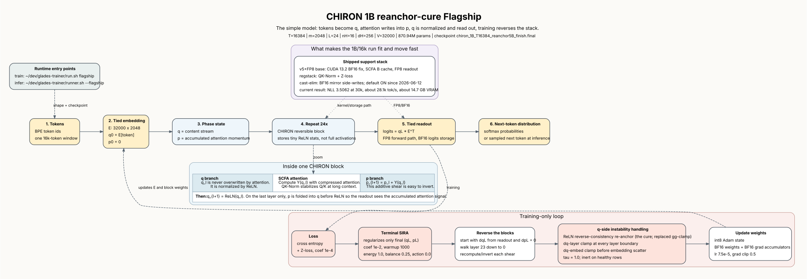

# CHIRON Flagship Architecture

Current production flagship: **CHIRON 1B reanchor-cure**,
`chiron_1B_T16384_reanchor5B_finish.final` (ship 2026-06-27; val ~1.92,
−0.62 nat over the prior data-scale ship via the ReLN reverse-consistency cure).

Editable source: `docs/chiron_flagship_architecture.dot`.

## How To Read It

Read the main path left to right: tokens become the `q` stream, CHIRON runs
24 reversible blocks over paired `(q, p)` state, and the tied readout uses
`q_L` to produce logits. The blue inset explains one block. The red strip is
training-only; inference stops at the next-token distribution.

## Source Of Truth

- Runtime assembly: `/home/robert/dev/glades-trainer/run.sh flagship`
- Inference checkpoint priority: `/home/robert/dev/glades-trainer/runner.sh --flagship`
- Forward/backward implementation: `/home/robert/dev/glades-trainer/trainer/chiron_main.cpp`
- Library primitives and architecture notes: `Backend/Machine Learning/Networks/cuda/gpu_chiron.*`,
  `Backend/Machine Learning/Networks/transformer_chiron_ops.h`,
  `CLAUDE.md`, and `research/CHIRON_framework.md`

The diagram intentionally distinguishes the production flagship from the separate
`run.sh chiron --scale ...` CHIRON-stack research line.
